SSO Keycloak POC - JavaScript Implicit
======================================

This `SSO Demo` uses four container instances:

- keycloak: the OAuth2(OpenID connection) server instance with database H2 embeded
- app1: simple web app
- app2: simple web app

```
version: '3.6'

services:

  keycloak:
      image: jboss/keycloak
      environment:
          - KEYCLOAK_LOGLEVEL=DEBUG
          - KEYCLOAK_USER=admin
          - KEYCLOAK_PASSWORD=admin
          - DB_VENDOR=H2
      ports:
          - 8090:8080
          - 9999:9990
          - 443:8443
      volumes:
          - ./data:/data

  app1:
      image: php:7.1-apache
      ports:
          - 8091:80
      volumes:
          - ./app1:/var/www/html

  app2:
      image: php:7.1-apache
      ports:
          - 8092:80
      volumes:
          - ./app2:/var/www/html

```

## Test case:

The user tries to access the user profile page on one of the web app,
and is redirected to login page on `keycloak` server at first.

If user is logged in, the further `authentication` on the other web apps will
not be required.


# Pre Install
Be sure that the `docker engine` & `docker-compose` are installed.

- Install docker engine: https://docs.docker.com/engine/installation/
- Install docker-compose: https://docs.docker.com/compose/install/


# step 1: 

start the container instances
`docker-compose up -d`


# step 2: 

Login on `keycloak` on `localhost:8090`

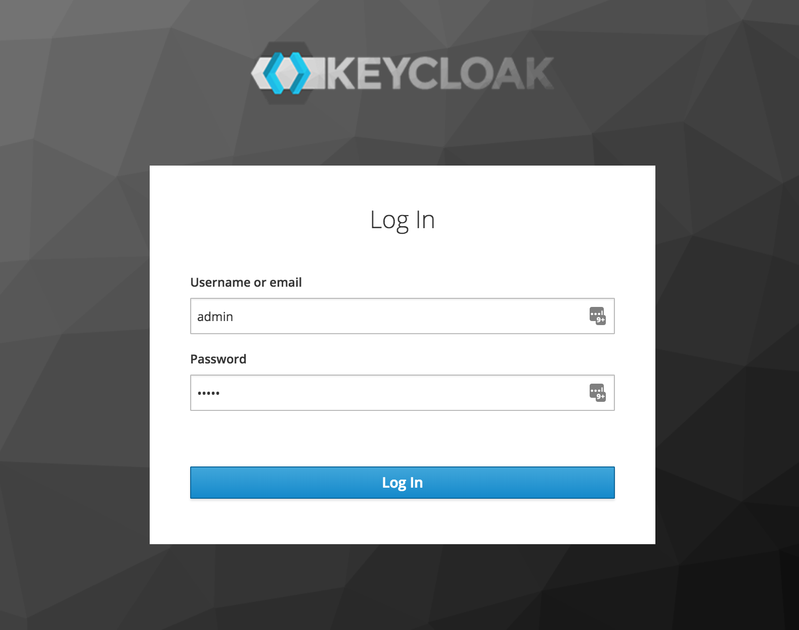

```
user: admin
password: admin
```


# step 3: 
create new `realm` named `myrealm`

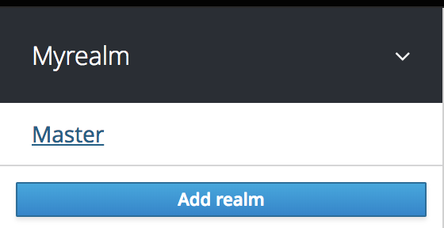

Enter in `myrealm` and click on tab `Login` and set the following.

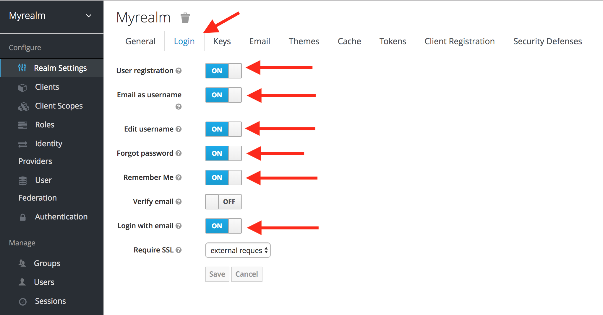

This will allow the user to be registered in the applications (so you can skip **step 5**)


# step 4: 

create new clients named with `web-app1` and `web-app2`
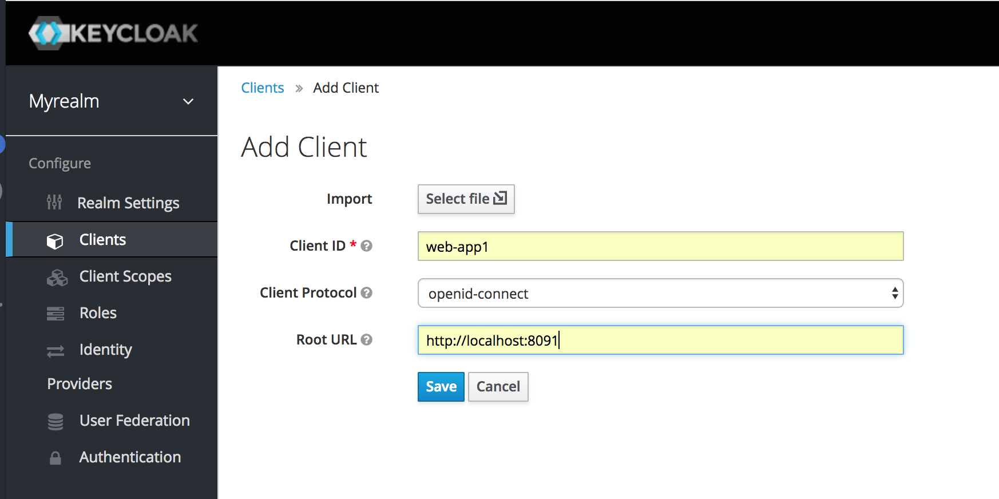

> repeat the operation to create another client named `web-app2`

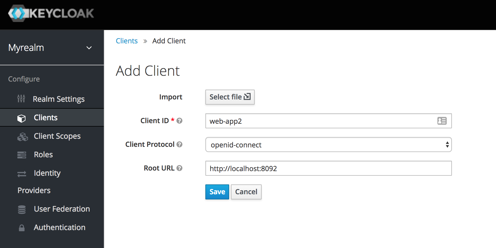

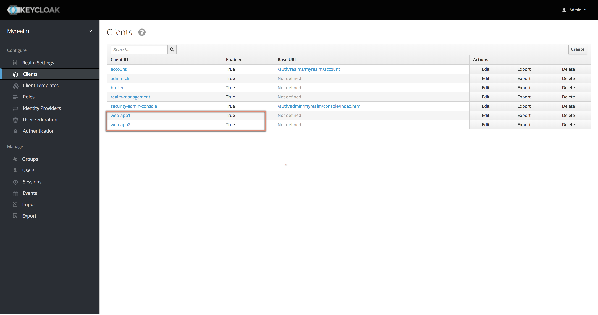

Click on `web-app1` and set the following setting:

- **Access Type**: `confidential`
- Disable **Standard Flow Enable**: `OFF`
- Enable **Implicit Flow Enable**: `ON`

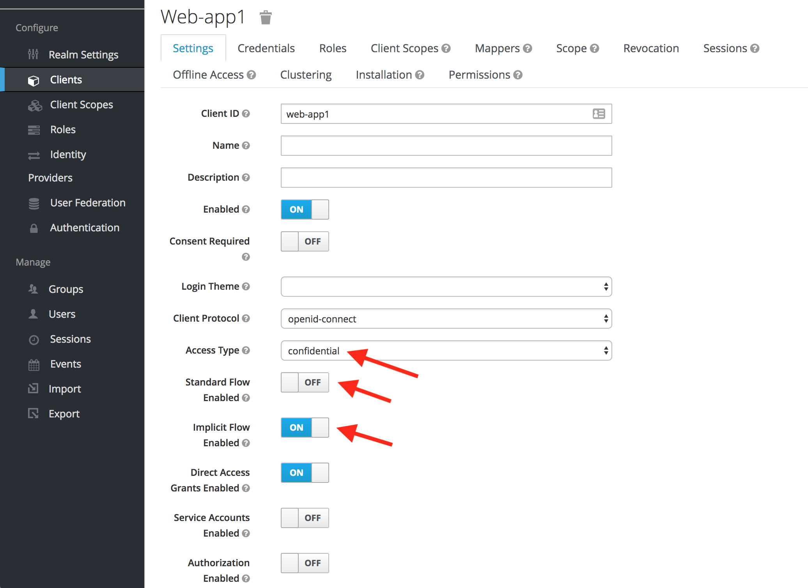

Do the same for `web-app2`.


# step 5:

create new user named `demo`

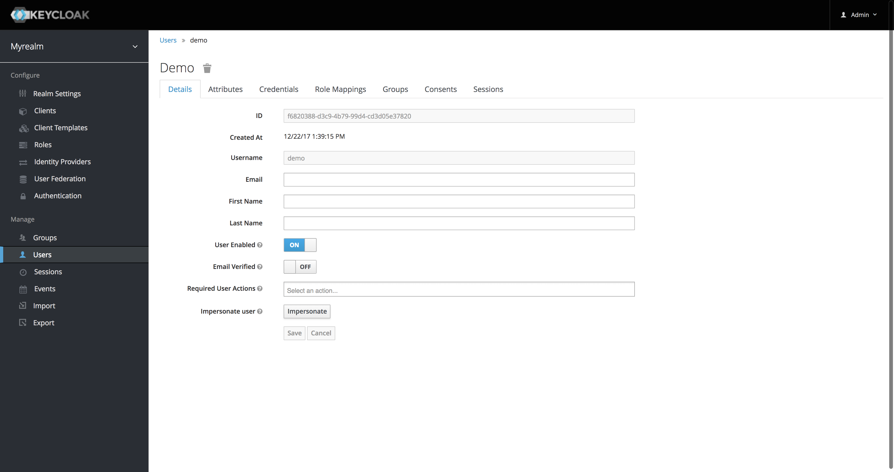

```
user: demo
password: demo
```


# step 6:

update the client credentials in `app1/app.js` with the created client credentials:
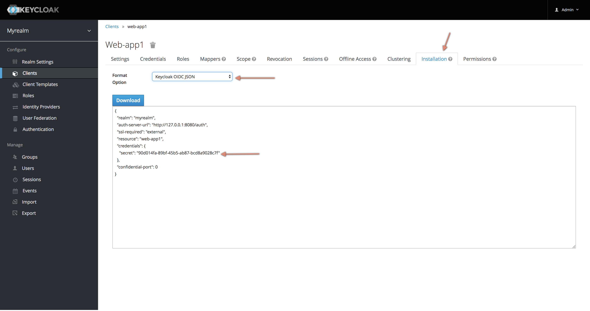
```javascript
//app1/app.js
let keycloakConfig = {
    "realm": "myrealm",
    "auth-server-url": "http://127.0.0.1:8080/auth",
    "ssl-required": "external",
    "resource": "web-app1",
    "credentials": {
        "secret": "90d014fa-89bf-45b5-ab87-bcd8a9028c7f"
    },
    "confidential-port": 0,
    "clientId": "web-app1"
};
```

> repeat the operation to update the credentials in `app2`


# step 7:
open the two web apps on

```
http://localhost:8091/
http://localhost:8092/
```


# step 8:

click on the link named `my account` on `web-app1`, the user should be redirected
to login page on the keycloak server `http://localhost:8090/auth/realms/myrealm/protocol/openid-connect/auth?client_id=web-app1&redirect_uri=http%3A%2F%2Flocalhost%3A8091%2Fme.html&state=228f9b01-2b83-446e-89ce-aac4bfba845e&nonce=82123d67-d176-403b-92aa-2303617d5183&response_mode=fragment&response_type=id_token%20token&scope=openid`

Login with

```
user: demo
pass: demo
```

After login, the user profile page will be shown:
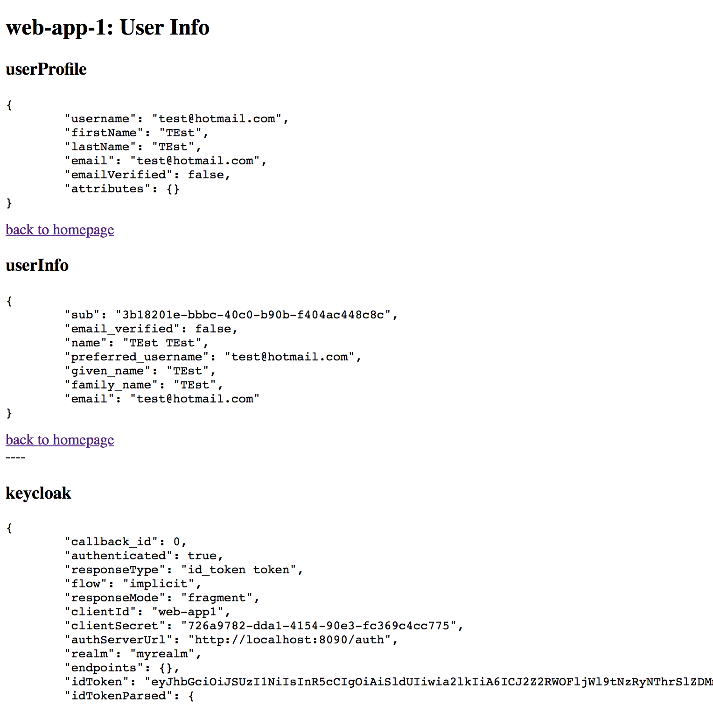

Click to see that the user is already logged in
```
http://localhost:8092/me.html
```

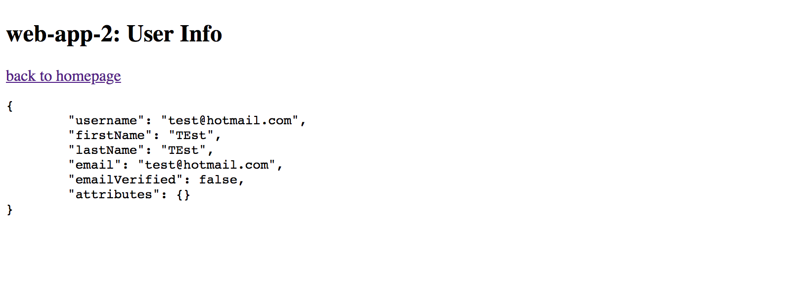

# step 9:
click on the link named `my account` on `web-app2`, the user will `NOT` be redirected 
to login page, because of login on the `web-app1` in the `step 8`.

---


# Stop the servers

```
docker-compose stop
```

# Clean up docker

> To clean up the test instances (stop and remove them)

```
docker-compose stop
docker-compose rm -f
```